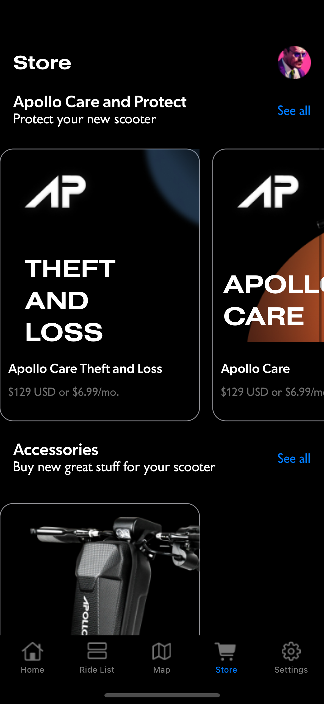
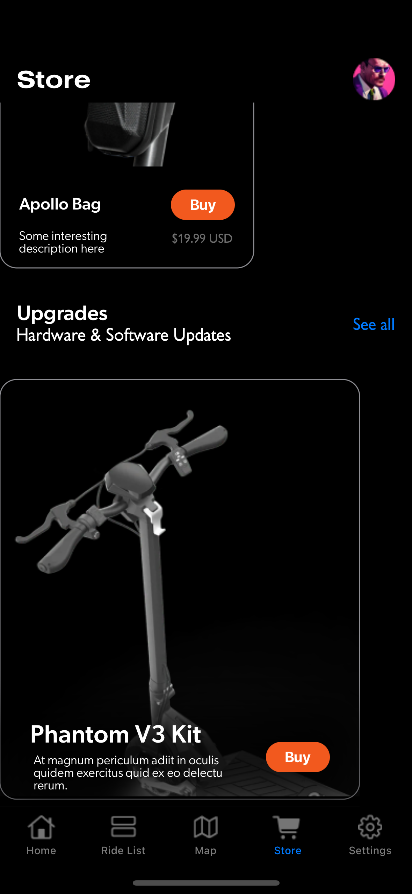

# Store Design iOS App
This is an iOS app built using Swift UI and is supported by iOS 16 and above. The app is a store design app that showcases various UI features such as tab bar, navigation bar, scroll view and implements relatively complex CSS using reusable code.

## Requirements
1. iOS 16.0 or higher.
2. Xcode 14.0 or higher.
3. Swift 5.0 or higher.

## Installation
1. Clone the repository to your local machine using Git:
2. Open the project in Xcode.
3. Build and run the application on simulator or physical device.

## Technical Details

- Navigation bar: The app uses a navigation bar at the top of the screen to show the title of different views and profile.
- Tab bar: The app features a tab bar at the bottom of the screen that allows the user to switch between different views of the app.
- Scroll view: The app uses a scroll view to display content that extends beyond the size of the screen.
- Complex CSS: The app implements relatively complex CSS to achieve custom styling of various UI components.
- External Fonts: External fonts have been packaged with the application.
- Reusable code: The app is built using Swift UI, which allows for the creation of reusable UI components that can be used throughout the app.

### Architectural Decisions and considerations for this project:

#### Use of MVVM framework 
MVVM, or Model-View-ViewModel, is a design pattern that is  used to achieve **Separation of Concerns**: MVVM separates the concerns of the user interface, business logic, and data model, making the code **easier to maintain, test, and modify**.

####  Use of Swift UI 
Swift UI is a relatively light weight framework and provides various advantages 

- **Declarative Syntax:** SwiftUI uses a declarative syntax that makes it easier to read, understand and write code. This makes it easier for developers to create complex user interfaces in a shorter amount of time.

- **Live Preview:** SwiftUI provides a live preview feature that allows developers to see their changes in real-time as they make them. This helps to reduce the time and effort required to iterate on designs and makes it easier to create dynamic and interactive user interfaces.

- **Easy Layouts:** SwiftUI has a powerful layout system that allows developers to build complex layouts using simple and intuitive code. The framework handles many of the common layout tasks automatically, such as spacing and alignment, making it easier for developers to create beautiful and responsive user interfaces.

#### Screenshots

